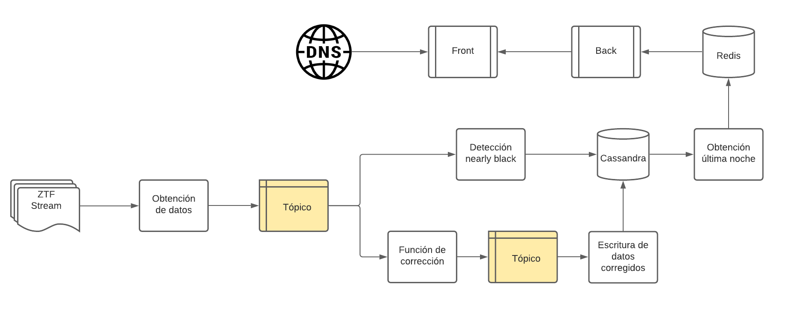
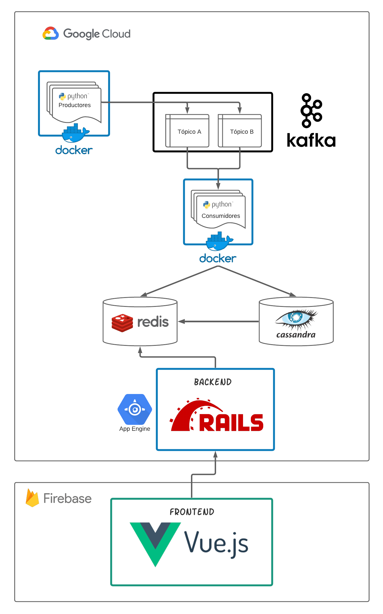

# SistemasDistribuidos-Lab 2-2020

Lab 3: El universo en un stream
  - Nicolás Gutiérrez ([ngutierrezp](https://github.com/ngutierrezp))
  - Roberto Lillo ([RobertoLillo](https://github.com/RobertoLillo))
  - Javier Pérez ([JavierPerezCaceres](https://github.com/JavierPerezCaceres))

## Contexto

El estudio de los datos astronomicos resulta de gran relevancia para conocer, estudiar y analizar distintos cuerpos celestes. Estos datos astronomicos pueden ser obtenidos del satelite  [Zwicky Transient Facility](https://www.ztf.caltech.edu/) (ZTF). 

###  Objetivos
  - Ser capaz de procesar un gran volumen de datos astronómicos en tiempo real.
  - Almacenar datos en bruto y resultados de funciones agregadas.
  - Disponibilizar plataforma sencilla para interactuar con los datos.

### Tecnologias a utilizar:

Para el desarrollo de este proyecto, se utilizaran las siguientes tecnologias:

  

-----------------------

## El universo en un stream

Como se disponen de muchos datos provenientes del ZTF es necesario ir procesando cada instancia de estos datos para obtener distintas metricas y correcciones que ajusten los distintos valores de las observaciones.

Sin embargo procesar una gran numero de datos resulta un tanto complejo puesto que se deben pasar por diferentes modulos que los procesen y guarden en las distintas bases de datos. Es por esto que se necesita un *Pipeline* para este stream de datos.

### Pipeline

En este caso el Pipeline contiene **dos** Tópicos :
  - El primero encargado disponibilizar los datos duros de una noche del ZTF
  - El segundo de encargado de disponibilizar los datos corregidos.
De esta forma el Pipeline queda: 

Estos tópicos estan administrados por kafka mientras que cada modulo (ya sea productor o consumidor) están realizados en el lengauje **Python**.

Cabe destacar que de este pipeline, no fue realizado el modulo de *analisis estadistico* debido a que require un nivel de procesamiento mayor en el pipeline y datos que no en todos las observaciones está presente. 

### Arquitectura de Pipeline

El proyecto posee la siguiente arquitectura utilizando el soporte de **Google Cloud** y **Firebase**

De esta forma el proyecto se encuentra disponible en [distribuidos2-2020-lab.web.app](https://distribuidos2-2020-lab.web.app/)

