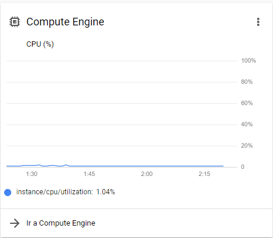

# SistemasDistribuidos-Lab 2-2020

Lab 3: El universo en un stream
  - Nicolás Gutiérrez ([ngutierrezp](https://github.com/ngutierrezp))
  - Roberto Lillo ([RobertoLillo](https://github.com/RobertoLillo))
  - Javier Pérez ([JavierPerezCaceres](https://github.com/JavierPerezCaceres))

## Contexto

El estudio de los datos astronómicos resulta de gran relevancia para conocer, estudiar y analizar distintos cuerpos celestes. Estos datos astronómicos pueden ser obtenidos del satélite  [Zwicky Transient Facility](https://www.ztf.caltech.edu/) (ZTF). 

### Objetivos
  - Ser capaz de procesar un gran volumen de datos astronómicos en tiempo real.
  - Almacenar datos en bruto y resultados de funciones agregadas.
  - Disponibilizar plataforma sencilla para interactuar con los datos.

### tecnologías a utilizar:

Para el desarrollo de este proyecto, se utilizarán las siguientes tecnologías:

  

-----------------------

## El universo en un stream

Como se disponen de muchos datos provenientes del ZTF es necesario ir procesando cada instancia de estos datos para obtener distintas métricas y correcciones que ajusten los distintos valores de las observaciones.

Sin embargo procesar una gran numero de datos resulta un tanto complejo puesto que se deben pasar por diferentes módulos que los procesen y guarden en las distintas bases de datos. Es por esto por lo que se necesita un *Pipeline* para este stream de datos.

### Pipeline

En este caso el Pipeline contiene **dos** Tópicos :
  - El primero encargado disponibilizar los datos duros de una noche del ZTF
  - El segundo de encargado de disponibilizar los datos corregidos.
De esta forma el Pipeline queda: 

Estos tópicos están administrados por kafka mientras que cada módulo (ya sea productor o consumidor) están realizados en el lenguaje **Python**.

Cabe destacar que de este pipeline, no fue realizado el módulo de *análisis estadístico* debido a que requiere un nivel de procesamiento mayor en el pipeline y datos que no en todos las observaciones está presente. 

### Arquitectura de Pipeline

El proyecto posee la siguiente arquitectura utilizando el soporte de **Google Cloud** y **Firebase**

De esta forma el proyecto se encuentra disponible en [distribuidos2-2020-lab.web.app](https://distribuidos2-2020-lab.web.app/)

Datos obtenidos:

## análisis

- El enfoque del pipeline es disponibilizar los últimos datos de forma rápida, pero guardando datos históricos

- En Pipeline posee un cuello de botella o una zona critica en donde el stream de datos es ralentizado por el cálculo de corrección:

- El uso de redis para la consulta del ultimo día resulto con gran éxito obteniendo el filtro de valores de cassandra y guardándolos en redis de forma temporal.

- Los productores y consumidores de momento solo trabajan 1 a 1, sin embargo esto se puede mejorar añadiendo más instancia de docker a cada parte del pipeline y administrando el `group.id` de Kafka mediante Zookeper.

- El diseño del pipeline resulta robusto para obtener un stream de datos y puede ser utilizado en cualquier contexto que necesite un preprocesamiento de datos.

- Si bien está enfocado a que existan un stream constante, esto no es del todo correcto ya que el ZTF sube un archivo comprimido al día por lo que el resto de las horas, el pipeline se encuentra sin uso por lo que existe un malgasto de recursos durante estos periodos.

